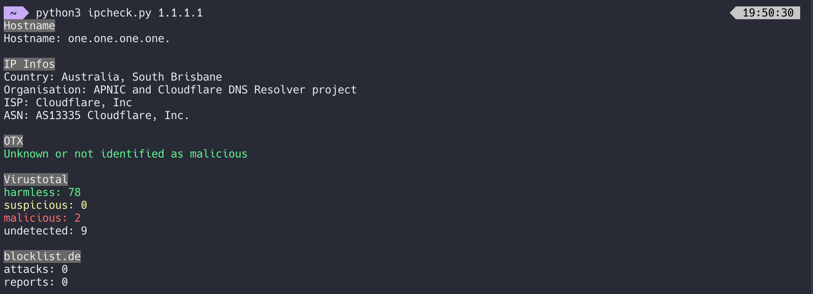
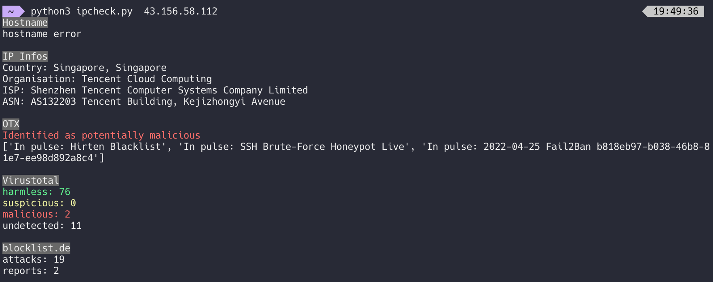

# IP Security Check
This script is a quick and dirty solution to check an IPv4 address.
You need an API Key for VirusTotal and OTX, which you can get for free at:

https://otx.alienvault.com/
https://www.virustotal.com/gui/join-us

The free tiers are more than enough for a couple of manual IP checks a day.
You may need to install some dependencies: 

```bash
pip install requests dnspython colorama vt-py OTXv2 iptools
wget https://raw.githubusercontent.com/AlienVault-OTX/OTX-Python-SDK/master/examples/is_malicious/get_malicious.py # to the same directory as this script
```

To use it, simply call the script with an IP address:
```bash
python3 ipcheck.py 1.1.1.1
```
Clean IP


Bad IP

